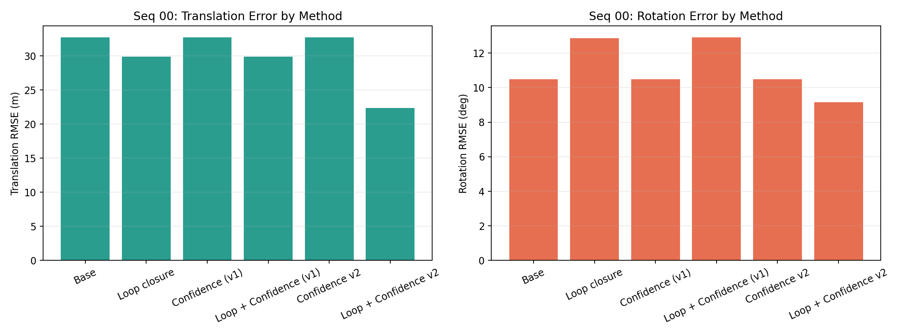
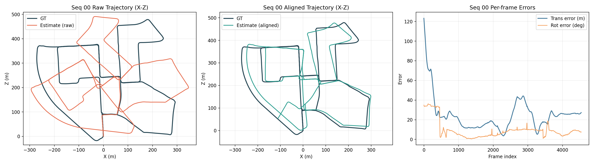
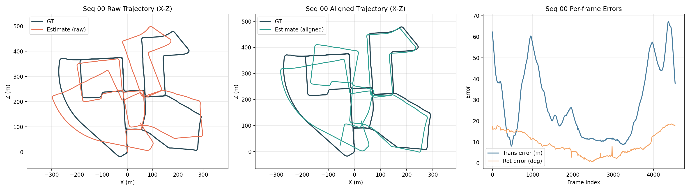
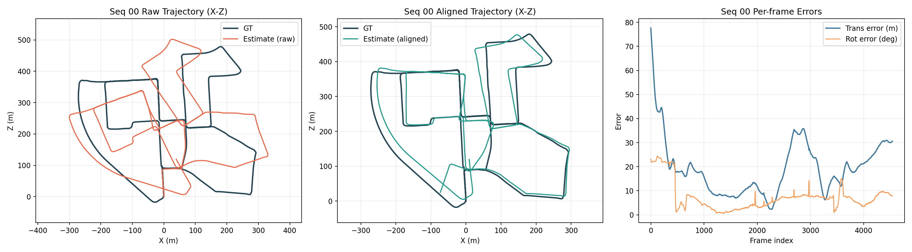

# Stereo VO + iSAM2 on KITTI Seq 00: Six-Method Comparative Analysis

## Abstract
This paper studies six variants of a stereo visual odometry + iSAM2 pose-graph pipeline on KITTI odometry sequence 00 (4541 poses). We compare: base iSAM2, loop closure, confidence weighting (v1), loop closure + confidence (v1), confidence-v2, and loop closure + confidence-v2. All methods share an identical frontend (ORB stereo matching + PnP RANSAC) and differ only in factor graph design and noise modeling.

The core question is whether confidence weighting materially improves trajectory quality, and if so, under what graph conditions. Results show that confidence-only variants without loop closure are effectively identical to base under SE(3)-aligned evaluation, while loop closure changes the global solution but can worsen rotation when loop constraints are not robustly weighted. The best configuration is loop closure + confidence-v2, which combines confidence-weighted odometry, confidence-weighted loop factors, and robust kernels, yielding the strongest translational improvement and improved rotational error relative to base.

These findings indicate that confidence modeling is most impactful when applied to globally corrective constraints (loop edges), not only local odometry edges.

## 1. Introduction and Context

### 1.1 Why this problem matters
Simultaneous Localization and Mapping (SLAM) estimates a robot trajectory while building or using a map of the environment [1, 2]. In visual SLAM, the system must infer camera motion from image measurements that are noisy, incomplete, and often ambiguous [2].

For long trajectories, small local errors accumulate into global drift. The core challenge is not only estimating local motion well, but also maintaining global consistency when revisiting places.

### 1.2 Pose-graph SLAM and iSAM2 in this project
This project uses a pose-graph formulation: each camera pose is a node, and relative motion constraints are edges [3].

The optimizer solves a nonlinear least-squares objective of the form:

$$
\hat{X} = \arg\min_X \sum_k \|r_k(X)\|^2_{\Omega_k}
$$

where:
- $X$ is the set of all poses,
- $r_k$ is the residual for factor $k$,
- $\Omega_k$ is the information (inverse covariance) of factor $k$.

iSAM2 is used as the backend optimizer because it incrementally updates the solution as new factors arrive, rather than solving from scratch every frame [4, 5]. This is important for real-time or near-real-time pipelines.

### 1.3 KITTI context
Experiments are run on KITTI odometry sequence 00 using all frames (4541 poses). KITTI is a standard benchmark for trajectory estimation and is challenging due to long urban driving trajectories, turns, texture changes, and accumulated drift sensitivity [8].

### 1.4 Objective of this report
This report compares six algorithmic variants implemented in the same codebase:
1. Base
2. Loop closure
3. Confidence (original)
4. Loop closure + Confidence (original)
5. Confidence v2
6. Loop closure + Confidence v2

The intent is to isolate what actually changes performance, and why.

## Related Work

### Factor-graph SLAM and incremental smoothing
Graph-based SLAM represents trajectory estimation as nonlinear least squares over poses and constraints [3]. Incremental smoothing methods such as iSAM and iSAM2 are widely used because they efficiently update the solution as new measurements arrive, rather than repeatedly solving a full batch problem [4, 5].

### Visual odometry frontends
Feature-based visual odometry pipelines typically combine sparse keypoint detection, descriptor matching, geometric filtering, and PnP/epipolar estimation [6, 7]. ORB-based frontends remain popular due to computational efficiency and reasonable robustness in large outdoor driving datasets such as KITTI [6, 7, 8].

### Loop closure in visual SLAM
Loop closure addresses long-horizon drift by adding non-consecutive constraints when revisiting locations [6, 9]. Prior work consistently shows that loop closure can significantly improve global consistency, but also that false-positive loops can cause catastrophic map deformation [6, 9]. This motivates strict candidate gating and robust backends.

### Robust optimization and confidence weighting
Robust M-estimators (for example, Huber and Cauchy) are a standard strategy to reduce outlier influence in graph optimization [10, 11]. Relatedly, confidence-aware weighting schemes scale factor covariances according to measurement reliability. The practical value of confidence weighting depends on where it is applied: reweighting local odometry may have limited effect in chain-like graphs, while reweighting global loop constraints can materially change the optimum.

### Positioning of this work
This report is a controlled ablation focused on backend behavior, not a new frontend. Compared with prior SLAM literature, the contribution here is an implementation-level, method-to-method comparison showing that confidence weighting becomes effective only when paired with loop-closure weighting and robust kernels in the same factor graph.

---

## 2. Experimental Setup

### 2.1 Data and sequence
- Dataset: KITTI odometry
- Sequence: 00
- Frames: all available (4541 estimated poses)

### 2.2 Common frontend/backend
All six methods share the same frontend and core backend components:
1. ORB feature detection and descriptor matching.
2. Stereo triangulation from left-right disparity on previous frame.
3. PnP RANSAC for frame-to-frame relative motion estimate.
4. Incremental iSAM2 optimization on SE(3) pose graph.

### 2.3 Evaluation protocol
- Trajectory comparison against KITTI ground truth using SE(3) alignment.
- Primary errors:
1. Translation RMSE (meters)
2. Rotation RMSE (degrees)

### 2.4 Output artifacts
Each method writes:
1. Estimated trajectory file
2. Per-method comparison plot against GT
3. Method summary JSON

All metrics below are sourced from the generated difference_summary.json files.

---

## 3. Methodology

### 3.1 Problem formulation and notation
Let the camera trajectory be $X = \{T_0, T_1, \dots, T_N\}$ where each $T_i \in SE(3)$ is the world-to-camera pose at frame $i$. The backend solves a pose-graph maximum a posteriori problem using factor residuals from odometry and, optionally, loop closure constraints.

The objective is:

$$
\hat{X} = \arg\min_X \sum_{(i,j)\in\mathcal{E}_o} \|r^o_{ij}(X)\|^2_{\Sigma^{-1}_{ij}} + \sum_{(p,q)\in\mathcal{E}_\ell} \|r^\ell_{pq}(X)\|^2_{\Lambda^{-1}_{pq}} + \|r_0(X)\|^2_{\Gamma^{-1}}
$$

where:
1. $\mathcal{E}_o$ are consecutive odometry edges,
2. $\mathcal{E}_\ell$ are non-consecutive loop edges,
3. $r_0$ is the anchor prior on $T_0$,
4. $\Sigma_{ij}$ and $\Lambda_{pq}$ are method-dependent covariance models.

All six methods share the same frontend and differ only in how $\mathcal{E}_\ell$ is constructed and how covariances are parameterized.

### 3.2 Frontend measurement pipeline
For each new frame pair, the relative motion measurement is produced by the same visual frontend:
1. ORB features and descriptors are extracted from stereo images.
2. Left-right matches on frame $i-1$ produce sparse 3D landmarks via disparity triangulation.
3. Temporal matches from frame $i-1$ to $i$ provide 2D-3D correspondences.
4. $\texttt{solvePnPRansac}$ estimates relative pose and inlier set [12].

If loop verification PnP fails, a 2D-2D essential matrix fallback may be used for loop hypothesis testing [13], with translation magnitude subsequently scaled from current graph geometry.

### 3.3 Backend optimization and update schedule
The backend uses iSAM2 incremental updates with relinearization skip set in the solver parameters. At each accepted frame transition:
1. A new between-factor is added for $(i-1, i)$.
2. The next-pose initialization is composed from the previous estimate and measurement.
3. iSAM2 performs an incremental update and returns the current optimized trajectory.

For methods with loop closure, extra between-factors are inserted asynchronously whenever a loop candidate is accepted.

### 3.4 Loop candidate generation and gating
Loop insertion (when enabled) follows the same structural logic in all loop-capable methods:
1. Candidate indices are restricted by minimum temporal separation.
2. Spatial candidate retrieval uses estimated trajectory proximity, with optional appearance scan fallback.
3. Each candidate is geometrically verified by relative pose estimation and inlier thresholds.
4. A consistency gate rejects candidates whose measured relative pose disagrees with current graph prediction beyond translation/rotation thresholds.

Only after these gates pass is a loop factor inserted; method variants differ in how that factor is weighted.

### 3.5 Confidence modeling

#### 3.5.1 Original confidence model (v1)
For v1, confidence is based on inlier ratio:

$$
c = \mathrm{clip}\left(\frac{n_{\text{inlier}}}{n_{\text{match}}}, c_{\min}, 1\right)^{\alpha}
$$

Odometry sigma scaling is mild:

$$
s_{v1} = \mathrm{clip}\left(\frac{1}{\sqrt{c}}, s_{\min}, s_{\max}\right)
$$

and the effective odometry covariance becomes $\Sigma' = s_{v1}^2\Sigma$.

#### 3.5.2 Confidence-v2 model
Confidence-v2 keeps the same normalization idea but uses stronger scaling and applies it to loop factors as well. For odometry/loop edges:

$$
s_{v2} = \mathrm{clip}\left(\frac{1}{c}, s_{\min}, s_{\max}\right)
$$

so low-confidence constraints are more aggressively downweighted than in v1.

For loop edges, confidence also incorporates geometric agreement:

$$
c_{\ell} \propto \text{inlier\_ratio}\cdot e^{-\Delta t/\tau_t}\cdot e^{-\Delta r/\tau_r}
$$

where $\Delta t$ and $\Delta r$ are loop-vs-graph translation/rotation disagreement terms.

### 3.6 Robust kernels (confidence-v2)
Confidence-v2 supports robust M-estimation (Huber/Cauchy) on weighted factors [10, 11]. Let $\rho(\cdot)$ denote the robust loss; the weighted residual contribution becomes:

$$
\rho\!\left(\|r\|^2_{\Sigma^{-1}_{\text{scaled}}}\right)
$$

This limits outlier leverage after factor insertion, especially for imperfect loop closures.

### 3.7 Method-specific formulations (M1-M6)

#### M1: Base iSAM2
1. Factor set: prior + consecutive odometry only.
2. Weighting: fixed odometry covariance.
3. Robust kernel: none.
4. Expected behavior: stable local integration, global drift unchecked.

#### M2: Loop closure
1. Factor set: M1 + loop factors from accepted candidates.
2. Weighting: fixed odometry and fixed loop covariance.
3. Robust kernel: none.
4. Expected behavior: better global consistency if loop edges are reliable; rotational degradation possible with noisy loop constraints.

#### M3: Confidence (original)
1. Factor set: same as M1.
2. Weighting: v1 confidence scaling on odometry only.
3. Robust kernel: none.
4. Expected behavior: limited deviation from M1 when confidence remains high and graph lacks loop constraints.

#### M4: Loop closure + Confidence (original)
1. Factor set: same as M2.
2. Weighting: v1 scaling on odometry; loop factors remain fixed.
3. Robust kernel: none.
4. Expected behavior: similar to M2 unless odometry weighting dominates, which is uncommon once many loop factors are active.

#### M5: Confidence v2
1. Factor set: same as M1.
2. Weighting: aggressive v2 scaling on odometry only.
3. Robust kernel: available.
4. Expected behavior: still close to M1 in a pure odometry-chain graph because no global loop constraints exist to re-balance.

#### M6: Loop closure + Confidence v2
1. Factor set: same as M2.
2. Weighting: aggressive v2 scaling on both odometry and loop factors.
3. Robust kernel: enabled on weighted factors.
4. Expected behavior: strongest suppression of uncertain constraints and best chance of improving both translation and rotation.

### 3.8 Controlled variables and fairness
To ensure a fair comparison, the following were held constant across all methods:
1. Same sequence and frame range (seq 00, all frames).
2. Same visual frontend and feature pipeline.
3. Same evaluation script and SE(3) alignment.
4. Same trajectory output and plotting procedure.

Therefore, observed differences are attributable to factor-set design, confidence weighting policy, and robust loss usage rather than frontend changes.

---

## 4. Quantitative Results (Seq 00, all frames)

| Method | Trans RMSE (m) | Rot RMSE (deg) | Delta Trans vs Base | Delta Rot vs Base |
|---|---:|---:|---:|---:|
| M1 Base | 32.7519 | 10.4945 | +0.00% | +0.00% |
| M2 Loop closure | 29.9193 | 12.8668 | -8.65% | +22.60% |
| M3 Confidence (original) | 32.7519 | 10.4945 | +0.00% | +0.00% |
| M4 Loop + Confidence (original) | 29.9251 | 12.9170 | -8.63% | +23.08% |
| M5 Confidence v2 | 32.7519 | 10.4945 | +0.00% | +0.00% |
| M6 Loop + Confidence v2 | 22.3712 | 9.1553 | -31.69% | -12.76% |

Additional run behavior observed:
1. Loop closure and loop + confidence (v1) accumulated very similar loop counts.
2. Loop + confidence v2 used slightly fewer loop insertions, with better final consistency.

---

## 5. Graphs

### 5.1 Consolidated six-method comparison
- 

### 5.2 Per-method trajectory and error plots
- M1 Base: 
- M2 Loop closure: 
- M3 Confidence (original): 
- M4 Loop + Confidence (original): 
- M5 Confidence v2: 
- M6 Loop + Confidence v2: 

### 5.3 Raw metric sources
- output/base_seq00_allframes/plots/difference_summary.json
- output/loop_seq00_allframes/plots/difference_summary.json
- output/confidence_seq00_allframes/plots/difference_summary.json
- output/loop_conf_seq00_allframes/plots/difference_summary.json
- output/confidence_v2_seq00_allframes/plots/difference_summary.json
- output/loop_conf_v2_seq00_allframes/plots/difference_summary.json
- output/method_compare_seq00/methods_summary.json

---

## 6. Analysis and Discussion

### 6.1 Why M3 and M5 equal M1
M3 and M5 both operate without loop closure. In this setting, the problem remains an odometry-chain graph. Reweighting chain edges (even with stronger scaling) often yields the same aligned trajectory trend because there are no competing global constraints to arbitrate.

### 6.2 Why M2 and M4 are nearly identical
In M4, only odometry factors receive v1 confidence weighting, while loop factors remain fixed-noise. Because loop factors dominate global corrections, M4 remains very close to M2.

### 6.3 Why M6 is best
M6 is the only variant that simultaneously:
1. adjusts odometry confidence,
2. adjusts loop confidence,
3. robustifies both with robust kernels.

That combination suppresses weak loop constraints and limits outlier leverage, improving both translation and rotation on this sequence.

### 6.4 Practical implication
Confidence weighting is not universally beneficial by itself. It becomes impactful when it targets the factors that most affect global consistency, especially loop closures, and when robust loss controls outliers.

---

## 7. Repro Commands (Seq 00, all frames)

Dataset root used in this project:
- ../../../scratch/rob530w26s001_class_root/rob530w26s001_class/shared_data/dataset

M1 Base:
```bash
python run_isam2_kitti.py \
  --seq 00 \
  --max-frames 0 \
  --output output/base_seq00_allframes/poses_est_00.txt \
  --skip-metrics
python plot_estimate_vs_gt.py \
  --estimates-dir output/base_seq00_allframes \
  --output-dir output/base_seq00_allframes/plots \
  --sequences 00
```

M2 Loop closure:
```bash
python run_isam2_kitti.py \
  --seq 00 \
  --max-frames 0 \
  --enable-loop-closure \
  --output output/loop_seq00_allframes/poses_est_00.txt \
  --skip-metrics
python plot_estimate_vs_gt.py \
  --estimates-dir output/loop_seq00_allframes \
  --output-dir output/loop_seq00_allframes/plots \
  --sequences 00
```

M3 Confidence (original):
```bash
python run_isam2_kitti.py \
  --seq 00 \
  --max-frames 0 \
  --enable-confidence-weighting \
  --output output/confidence_seq00_allframes/poses_est_00.txt \
  --skip-metrics
python plot_estimate_vs_gt.py \
  --estimates-dir output/confidence_seq00_allframes \
  --output-dir output/confidence_seq00_allframes/plots \
  --sequences 00
```

M4 Loop + Confidence (original):
```bash
python run_isam2_kitti.py \
  --seq 00 \
  --max-frames 0 \
  --enable-loop-closure \
  --enable-confidence-weighting \
  --output output/loop_conf_seq00_allframes/poses_est_00.txt \
  --skip-metrics
python plot_estimate_vs_gt.py \
  --estimates-dir output/loop_conf_seq00_allframes \
  --output-dir output/loop_conf_seq00_allframes/plots \
  --sequences 00
```

M5 Confidence v2:
```bash
python run_isam2_kitti.py \
  --seq 00 \
  --max-frames 0 \
  --enable-confidence-v2 \
  --output output/confidence_v2_seq00_allframes/poses_est_00.txt \
  --skip-metrics
python plot_estimate_vs_gt.py \
  --estimates-dir output/confidence_v2_seq00_allframes \
  --output-dir output/confidence_v2_seq00_allframes/plots \
  --sequences 00
```

M6 Loop + Confidence v2:
```bash
python run_isam2_kitti.py \
  --seq 00 \
  --max-frames 0 \
  --enable-loop-closure \
  --enable-confidence-v2 \
  --output output/loop_conf_v2_seq00_allframes/poses_est_00.txt \
  --skip-metrics
python plot_estimate_vs_gt.py \
  --estimates-dir output/loop_conf_v2_seq00_allframes \
  --output-dir output/loop_conf_v2_seq00_allframes/plots \
  --sequences 00
```

---

## 8. Final Conclusion
For KITTI seq 00 (all frames), the six-method comparison shows:
1. Original confidence weighting has negligible effect in this setup.
2. Loop closure alone improves translation but can worsen rotation.
3. Confidence-v2 by itself still matches base when loops are absent.
4. Loop closure + confidence-v2 is the best method tested so far, with substantial translation gain and improved rotation over base.

Best current method in this report:
- Loop closure + confidence v2 (M6)
- Trans RMSE: 22.3712 m
- Rot RMSE: 9.1553 deg

## 9. References
1. H. Durrant-Whyte and T. Bailey, "Simultaneous localization and mapping: part I," IEEE Robotics & Automation Magazine, vol. 13, no. 2, pp. 99-110, 2006.
2. C. Cadena, L. Carlone, H. Carrillo, Y. Latif, D. Scaramuzza, J. Neira, I. Reid, and J. J. Leonard, "Past, present, and future of simultaneous localization and mapping: toward the robust-perception age," IEEE Transactions on Robotics, vol. 32, no. 6, pp. 1309-1332, 2016.
3. G. Grisetti, R. Kummerle, C. Stachniss, and W. Burgard, "A tutorial on graph-based SLAM," IEEE Intelligent Transportation Systems Magazine, vol. 2, no. 4, pp. 31-43, 2010.
4. M. Kaess, H. Johannsson, R. Roberts, V. Ila, J. J. Leonard, and F. Dellaert, "iSAM2: Incremental smoothing and mapping using the Bayes tree," The International Journal of Robotics Research, vol. 31, no. 2, pp. 216-235, 2012.
5. M. Kaess, A. Ranganathan, and F. Dellaert, "iSAM: Incremental smoothing and mapping," IEEE Transactions on Robotics, vol. 24, no. 6, pp. 1365-1378, 2008.
6. R. Mur-Artal and J. D. Tardos, "ORB-SLAM2: An open-source SLAM system for monocular, stereo, and RGB-D cameras," IEEE Transactions on Robotics, vol. 33, no. 5, pp. 1255-1262, 2017.
7. E. Rublee, V. Rabaud, K. Konolige, and G. Bradski, "ORB: An efficient alternative to SIFT or SURF," in Proceedings of ICCV, 2011, pp. 2564-2571.
8. A. Geiger, P. Lenz, and R. Urtasun, "Are we ready for autonomous driving? The KITTI vision benchmark suite," in Proceedings of CVPR, 2012, pp. 3354-3361.
9. M. Cummins and P. Newman, "FAB-MAP: Probabilistic localization and mapping in the space of appearance," The International Journal of Robotics Research, vol. 27, no. 6, pp. 647-665, 2008.
10. P. J. Huber, "Robust estimation of a location parameter," The Annals of Mathematical Statistics, vol. 35, no. 1, pp. 73-101, 1964.
11. S. Agarwal, K. Mierle, and Others, "Ceres Solver," 2012. [Online]. Available: http://ceres-solver.org
12. V. Lepetit, F. Moreno-Noguer, and P. Fua, "EPnP: An accurate O(n) solution to the PnP problem," International Journal of Computer Vision, vol. 81, no. 2, pp. 155-166, 2009.
13. D. Nister, "An efficient solution to the five-point relative pose problem," IEEE Transactions on Pattern Analysis and Machine Intelligence, vol. 26, no. 6, pp. 756-770, 2004.
