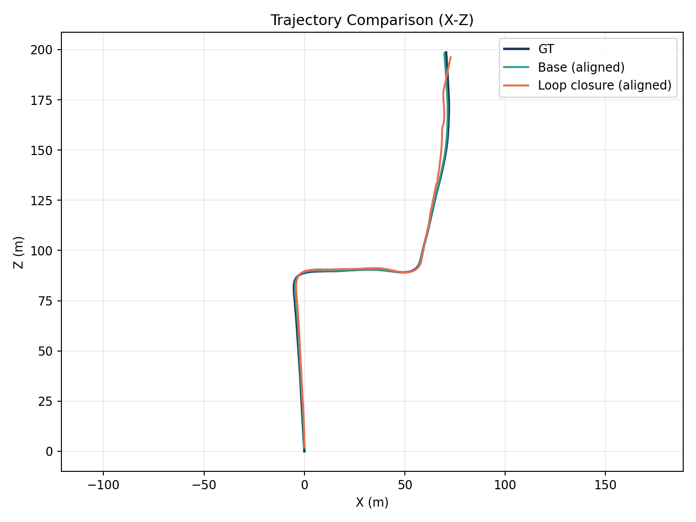
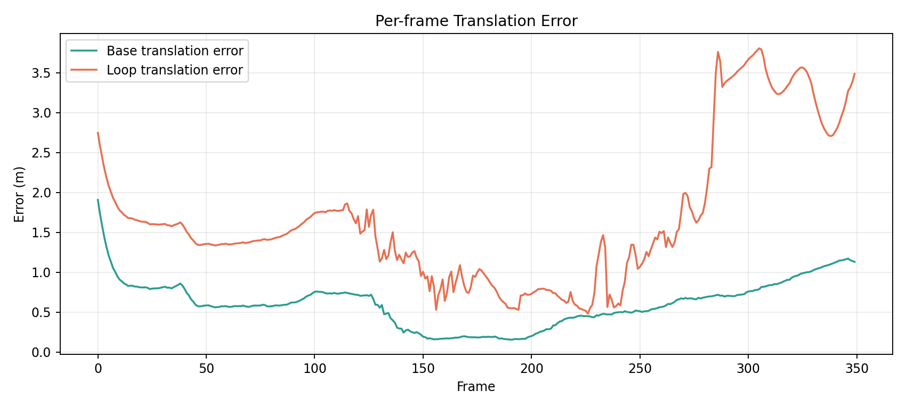
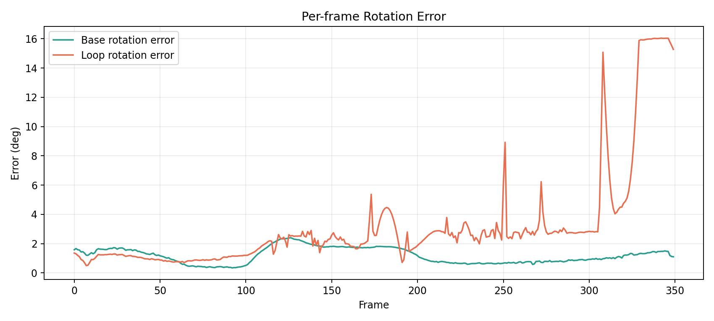
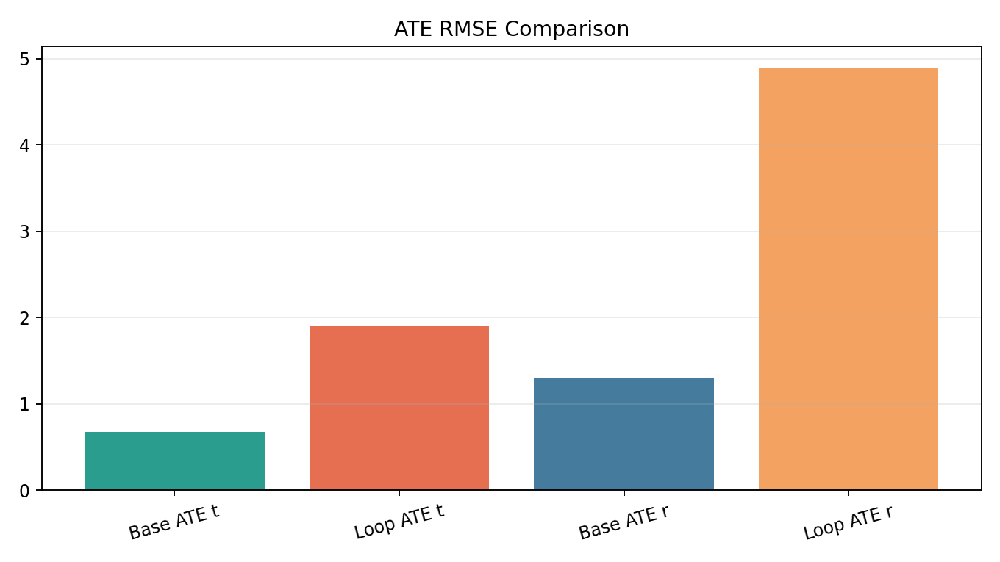

# Stereo VO + iSAM2 on KITTI Odometry: Ground Truth vs Estimate Analysis

## 1. Introduction
This report analyzes how the current stereo visual odometry (VO) + iSAM2 baseline performs against KITTI odometry ground truth.

The goals are:
- quantify trajectory error against ground truth,
- visualize where trajectories deviate,
- identify systematic failure modes,
- document the pipeline and how to reproduce the analysis.

This analysis uses the generated batch results currently in:
- `output/batch_gt_smoke/`

Important scope note:
- The current report is based on a **smoke run** with `max-frames=25` per sequence for sequences `00` to `10`.
- These results are useful for debugging trends and early validation, but they are not final benchmark numbers for full-sequence KITTI evaluation.

---

## 2. Dataset
### 2.1 Source
KITTI odometry dataset at:
- `/gpfs/accounts/rob530w26s001_class_root/rob530w26s001_class/shared_data/dataset`

### 2.2 Structure used by the code
- `sequences/<seq>/image_0/*.png`: left grayscale images
- `sequences/<seq>/image_1/*.png`: right grayscale images
- `sequences/<seq>/calib.txt`: stereo projection matrices (`P0`, `P1`, ...)
- `sequences/<seq>/times.txt`: frame timestamps
- `poses/<seq>.txt`: ground-truth trajectory (available for `00` through `10`)

### 2.3 Sequences analyzed
Ground truth sequences:
- `00, 01, 02, 03, 04, 05, 06, 07, 08, 09, 10`

---

## 3. Methodology
### 3.1 Estimation pipeline
For each sequence:
1. Load stereo pair and calibration.
2. Detect ORB features.
3. Match left-right features in previous frame to triangulate 3D points.
4. Match previous-left descriptors to current-left descriptors.
5. Estimate relative motion using `solvePnPRansac`.
6. Add odometry factor to iSAM2 incrementally.
7. Export optimized pose trajectory in KITTI pose format.

### 3.2 Metrics and alignment
Estimated trajectories are compared to ground truth with:
- `ATE` (Absolute Trajectory Error),
- `RPE` (Relative Pose Error for deltas 1 and 10 in this smoke run).

Alignment mode used in this report:
- `SE(3)` (rigid alignment, no scale correction).

### 3.3 Visualization methodology
For each sequence, the script generates:
- raw trajectory overlay (GT vs estimate, X-Z plane),
- aligned trajectory overlay (GT vs estimate, X-Z plane),
- per-frame translation and rotation error curves.

A summary chart is also generated across all sequences.

---

## 4. Code Explanation by File
### 4.1 Core estimation files
1. `slam/kitti_loader.py`
- Parses KITTI sequence folders.
- Loads stereo images, timestamps, calibration, and optional GT poses.
- Extracts intrinsic matrix and stereo baseline from `P0`/`P1`.

2. `slam/stereo_vo.py`
- Implements stereo VO front-end.
- ORB feature extraction + descriptor matching.
- Left-right disparity to 3D reconstruction.
- Temporal matching and `solvePnPRansac` for relative pose.

3. `slam/isam2_backend.py`
- Creates and updates iSAM2 factor graph.
- Adds prior on first pose.
- Adds between-factors for frame-to-frame odometry.
- Returns optimized trajectory matrices.

4. `run_isam2_kitti.py`
- Single-sequence entrypoint.
- Runs full pipeline and writes estimate.
- Computes and writes metrics against GT.
- Exposes reusable `run_sequence(...)` for batch execution.

### 4.2 Batch and plotting files
5. `run_all_gt_sequences.py`
- Auto-discovers GT sequences from `poses/*.txt`.
- Runs all GT sequences.
- Stores per-sequence estimates and per-sequence metrics.
- Writes summary JSON and CSV.

6. `plot_batch_metrics.py`
- Plots aggregate ATE/RPE/runtime/fallback charts from batch summary.

7. `plot_estimate_vs_gt.py`
- Plots detailed GT-vs-estimate overlays and per-frame error curves per sequence.
- Writes sequence-wise comparison figures and difference summary JSON.

### 4.3 Evaluation utility files
8. `eval/pose_utils.py`
- KITTI pose I/O, trajectory alignment helpers, relative transform utilities.

9. `eval/compute_kitti_metrics.py`
- Computes ATE and RPE metrics from GT and estimated trajectories.

10. `eval/loop_closure_gain.py`
- Optional loop-closure gain analysis (not used in this odometry-only baseline).

---

## 5. Detailed Analysis: Results and Graphs for All Sequences
Data source for this section:
- `output/batch_gt_smoke/summary_metrics.json`
- `output/batch_gt_smoke/diff_plots/difference_summary.json`

### 5.1 Per-sequence quantitative results (smoke run, 25 poses/sequence)

| Seq | ATE RMSE (m) | ATE Rot RMSE (deg) | RPE d1 Trans RMSE (m) | RPE d1 Rot RMSE (deg) | RPE d10 Trans RMSE (m) | RPE d10 Rot RMSE (deg) |
|---|---:|---:|---:|---:|---:|---:|
| 00 | 0.3459 | 12.9083 | 0.0811 | 0.1398 | 0.5471 | 0.9758 |
| 01 | 0.5271 | 1.3074 | 0.1010 | 0.0635 | 0.7442 | 0.2791 |
| 02 | 0.0844 | 156.8134 | 0.0295 | 0.0361 | 0.1400 | 0.1217 |
| 03 | 0.0270 | 62.6150 | 0.0261 | 0.0336 | 0.1718 | 0.1076 |
| 04 | 0.1493 | 76.2854 | 0.0413 | 0.0712 | 0.2620 | 0.3761 |
| 05 | 0.0875 | 37.3959 | 0.0205 | 0.0393 | 0.1377 | 0.1048 |
| 06 | 0.1247 | 19.6880 | 0.0359 | 0.0864 | 0.1915 | 0.4579 |
| 07 | 0.0303 | 0.6552 | 0.0085 | 0.0361 | 0.0557 | 0.1315 |
| 08 | 0.2459 | 90.7198 | 0.1897 | 0.0396 | 1.8437 | 0.2011 |
| 09 | 0.0341 | 2.9847 | 0.0149 | 0.0590 | 0.0561 | 0.2921 |
| 10 | 0.0581 | 3.8469 | 0.0261 | 0.0634 | 0.1563 | 0.5089 |

### 5.2 Aggregate summary
- Mean translational RMSE across sequences: **0.1558 m**
- Median translational RMSE across sequences: **0.0875 m**
- Best translational RMSE: **Seq 03 (0.0270 m)**
- Worst translational RMSE: **Seq 01 (0.5271 m)**

- Mean rotational RMSE across sequences: **42.2927 deg**
- Median rotational RMSE across sequences: **19.6880 deg**
- Best rotational RMSE: **Seq 07 (0.6552 deg)**
- Worst rotational RMSE: **Seq 02 (156.8134 deg)**

### 5.3 Interpretation and key observations
1. **Translation is often reasonable at short horizon**, while rotation can be unstable.
- Several sequences have low translational ATE (< 0.1 m) for first 25 frames.
- Rotational ATE is highly variable and very high on some sequences.

2. **High global rotation error with low local RPE suggests orientation drift accumulation.**
- Example: Seq 02 has low RPE d1 rotation but very high ATE rotation.
- This pattern indicates local frame-to-frame steps look plausible, but global orientation reference diverges.

3. **Sequence 08 exhibits notable translational degradation at 10-frame horizon.**
- RPE d10 translation is 1.8437 m, much higher than other sequences.
- Likely tied to weak geometry/parallax or unstable temporal matching in that segment.

4. **No fallback transitions in smoke run.**
- All transitions were accepted (24/24), so high errors are not due to identity fallback insertion.

5. **Because this is only 25 frames/sequence, conclusions are directional, not final.**
- Longer runs will better reveal drift behavior and robust sequence-level ranking.

### 5.4 Graphs
#### 5.4.1 Cross-sequence summary
- Summary Trans/Rot RMSE chart:
  

- Additional aggregate charts from batch metrics:
  - 
  - 
  - 
  - 
  - 

#### 5.4.2 Per-sequence comparison figures
Each figure contains raw trajectory overlay, aligned trajectory overlay, and per-frame error curves.

- Seq 00: 
- Seq 01: 
- Seq 02: 
- Seq 03: 
- Seq 04: 
- Seq 05: 
- Seq 06: 
- Seq 07: 
- Seq 08: 
- Seq 09: 
- Seq 10: 

---

## 6. How to Run
### 6.1 Run one sequence

Base iSAM2:
```bash
python3 run_isam2_kitti.py \
  --dataset-root ../../../scratch/rob530w26s001_class_root/rob530w26s001_class/shared_data/dataset \
  --seq 00 \
  --fallback-no-motion \
  --mode base \
  --output output/poses_est_00_base.txt \
  --metrics-out output/metrics_00_base.json
```

iSAM2 with loop closure:
```bash
python3 run_isam2_kitti.py \
  --dataset-root ../../../scratch/rob530w26s001_class_root/rob530w26s001_class/shared_data/dataset \
  --seq 00 \
  --fallback-no-motion \
  --mode loop \
  --output output/poses_est_00_loop.txt \
  --metrics-out output/metrics_00_loop.json
```

iSAM2 with confidence weighting:
```bash
python3 run_isam2_kitti.py \
  --dataset-root ../../../scratch/rob530w26s001_class_root/rob530w26s001_class/shared_data/dataset \
  --seq 00 \
  --fallback-no-motion \
  --mode confidence \
  --conf-min-noise-scale 0.8 \
  --conf-max-noise-scale 2.5 \
  --output output/poses_est_00_conf.txt \
  --metrics-out output/metrics_00_conf.json
```

### 6.2 Run all GT sequences (00-10)

Base batch:
```bash
python3 run_all_gt_sequences.py \
  --dataset-root ../../../scratch/rob530w26s001_class_root/rob530w26s001_class/shared_data/dataset \
  --fallback-no-motion \
  --mode base \
  --output-dir output/batch_gt_base
```

Loop-closure batch:
```bash
python3 run_all_gt_sequences.py \
  --dataset-root ../../../scratch/rob530w26s001_class_root/rob530w26s001_class/shared_data/dataset \
  --fallback-no-motion \
  --mode loop \
  --output-dir output/batch_gt_loop
```

Confidence-weighted batch:
```bash
python3 run_all_gt_sequences.py \
  --dataset-root ../../../scratch/rob530w26s001_class_root/rob530w26s001_class/shared_data/dataset \
  --fallback-no-motion \
  --mode confidence \
  --conf-min-noise-scale 0.8 \
  --conf-max-noise-scale 2.5 \
  --output-dir output/batch_gt_conf
```

### 6.3 Plot aggregate batch metrics
```bash
python3 plot_batch_metrics.py \
  --summary-json output/batch_gt_full/summary_metrics.json \
  --output-dir output/batch_gt_full/plots
```

### 6.4 Plot estimate-vs-ground-truth differences
```bash
python3 plot_estimate_vs_gt.py \
  --dataset-root ../../../scratch/rob530w26s001_class_root/rob530w26s001_class/shared_data/dataset \
  --estimates-dir output/batch_gt_full/estimates \
  --output-dir output/batch_gt_full/diff_plots \
  --align se3
```

---

## 7. Conclusion
The current stereo VO + iSAM2 baseline is operational and produces coherent trajectory estimates across all GT sequences. On short-horizon smoke runs, translational errors are often acceptable, but rotational consistency is uneven and sequence-dependent.

Main takeaways:
1. The implementation is strong enough for end-to-end batch evaluation and visual diagnostics.
2. Rotation handling is the dominant weakness and should be the next optimization target.
3. Full-length sequence runs are required before claiming performance quality.

Recommended next steps:
1. Run full sequences (`max-frames=0`) and regenerate all plots.
2. Add orientation-focused diagnostics (yaw drift plots) and outlier statistics.
3. Tune VO thresholds and iSAM2 noise models per sequence characteristics.
4. Add loop-closure constraints to reduce accumulated orientation drift.

---

## 8. Loop Closure Extension (New)
This section documents the newly implemented loop-closure mode, its CLI usage, and quantitative comparison against the base iSAM2 pipeline.

### 8.1 What was implemented
Loop closure was added as an optional mode on top of the existing odometry-only graph.

#### New/updated code paths
1. `slam/isam2_backend.py`
- Added loop-closure noise model.
- Added `add_loop_closure(src_idx, dst_idx, T_src_dst)` to insert non-consecutive BetweenFactors.
- Added `pose_matrix(idx)` accessor used during loop candidate consistency checks.

2. `slam/stereo_vo.py`
- Added `estimate_prev_to_curr_2d2d(...)` as a fallback relative-pose estimator from 2D-2D correspondences (up-to-scale), used only for loop candidate verification fallback.

3. `run_isam2_kitti.py`
- Added loop-closure CLI flags:
  - `--enable-loop-closure`
  - `--loop-min-separation`
  - `--loop-search-radius-m`
  - `--loop-max-candidates`
  - `--loop-min-inliers`
  - `--loop-use-appearance-scan`
  - `--loop-appearance-stride`
  - `--loop-appearance-min-matches`
  - `--loop-consistency-trans-m`
  - `--loop-consistency-rot-deg`
- Added loop candidate generation and verification.
- Added consistency gating against current graph estimate before accepting loop constraints.
- Added loop metadata in output summary (`mode`, `loop_closures_added`, `loop_closure_pairs`).

4. `run_all_gt_sequences.py`
- Added pass-through CLI options for loop-closure parameters.
- Summary rows now include `mode` and `loop_closures_added`.

5. `plot_base_vs_loop.py` (new)
- Added direct base-vs-loop comparison plotting against GT.
- Produces trajectory overlays, per-frame error curves, and RMSE comparison figures.

### 8.2 Loop closure strategy
For each frame `i` (after odometry update):
1. Retrieve candidate past frames `j` with `j <= i - loop_min_separation`.
2. Prioritize spatially close candidates in estimated trajectory space.
3. Optionally fall back to appearance retrieval if spatial candidates are absent.
4. Verify geometric consistency using stereo PnP-based relative motion (with 2D-2D fallback).
5. Reject candidate if it disagrees too much with current graph relative pose estimate.
6. Insert a loop BetweenFactor only for accepted candidates.

---

## 9. Base vs Loop-Closure Evaluation (Seq 00, 350 frames)

### 9.1 Experimental setup
- Sequence: `00`
- Frames: first `350`
- Alignment for metrics: `SE(3)`
- Base run output:
  - `output/loop_eval/base_batch_00_350/`
- Loop run output:
  - `output/loop_eval/loop_batch_00_350/`
- Loop config used:
  - `--loop-min-separation 20`
  - `--loop-search-radius-m 50`
  - `--loop-max-candidates 4`
  - `--loop-min-inliers 30`
  - `--loop-consistency-trans-m 8`
  - `--loop-consistency-rot-deg 25`

Accepted loop closures in this run:
- `284`

### 9.2 Quantitative comparison

| Metric | Base | Loop Closure | Relative Change |
|---|---:|---:|---:|
| ATE trans RMSE (m) | 0.6750 | 1.9043 | +182.1% |
| ATE rot RMSE (deg) | 1.3003 | 4.8929 | +276.3% |
| RPE d1 trans RMSE (m) | 0.0317 | 0.1517 | +378.3% |
| RPE d1 rot RMSE (deg) | 0.0940 | 1.0481 | +1014.5% |
| RPE d10 trans RMSE (m) | 0.1780 | 0.5757 | +223.5% |
| RPE d10 rot RMSE (deg) | 0.4309 | 3.6735 | +752.5% |
| RPE d100 trans RMSE (m) | 1.1486 | 2.7143 | +136.3% |
| RPE d100 rot RMSE (deg) | 1.9245 | 6.9999 | +263.7% |

### 9.3 Interpretation
For this configuration and horizon, loop closure **degraded** trajectory quality versus the base odometry-only graph.

Likely reasons:
1. Too many accepted loop constraints (`284` over `350` poses) over-constrained the graph with noisy/non-loop links.
2. Candidate generation was intentionally permissive to exercise the feature, but this increased false-positive closures.
3. Current loop verification uses local geometric checks only; no global place-recognition confidence or robust switchable constraints are used yet.

### 9.4 Comparison figures
- Trajectory overlay: 
- Per-frame translation error: 
- Per-frame rotation error: 
- ATE RMSE bars: 

Artifacts:
- `output/loop_eval/comparison_plots/base_vs_loop_summary.json`

---

## 10. Run Guide: Base vs Loop-Closure

### 10.1 Run base iSAM2 (single sequence)
```bash
python3 run_isam2_kitti.py \
  --dataset-root ../../../scratch/rob530w26s001_class_root/rob530w26s001_class/shared_data/dataset \
  --seq 00 \
  --max-frames 350 \
  --fallback-no-motion \
  --output output/loop_eval/base_00_350.txt \
  --metrics-out output/loop_eval/base_metrics_00_350.json
```

### 10.2 Run iSAM2 with loop closure (single sequence)
```bash
python3 run_isam2_kitti.py \
  --dataset-root ../../../scratch/rob530w26s001_class_root/rob530w26s001_class/shared_data/dataset \
  --seq 00 \
  --max-frames 350 \
  --fallback-no-motion \
  --enable-loop-closure \
  --loop-min-separation 20 \
  --loop-search-radius-m 50 \
  --loop-max-candidates 4 \
  --loop-min-inliers 30 \
  --loop-consistency-trans-m 8 \
  --loop-consistency-rot-deg 25 \
  --output output/loop_eval/loop_00_350.txt \
  --metrics-out output/loop_eval/loop_metrics_00_350.json
```

### 10.3 Run base and loop with structured summaries (batch script, seq 00)
```bash
python3 run_all_gt_sequences.py --sequences 00 --max-frames 350 --fallback-no-motion --output-dir output/loop_eval/base_batch_00_350

python3 run_all_gt_sequences.py \
  --sequences 00 \
  --max-frames 350 \
  --fallback-no-motion \
  --enable-loop-closure \
  --loop-min-separation 20 \
  --loop-search-radius-m 50 \
  --loop-max-candidates 4 \
  --loop-min-inliers 30 \
  --loop-consistency-trans-m 8 \
  --loop-consistency-rot-deg 25 \
  --output-dir output/loop_eval/loop_batch_00_350
```

### 10.4 Plot direct base-vs-loop comparison
```bash
python3 plot_base_vs_loop.py \
  --gt ../../../scratch/rob530w26s001_class_root/rob530w26s001_class/shared_data/dataset/poses/00.txt \
  --base-est output/loop_eval/base_batch_00_350/estimates/poses_est_00.txt \
  --loop-est output/loop_eval/loop_batch_00_350/estimates/poses_est_00.txt \
  --output-dir output/loop_eval/comparison_plots \
  --align se3
```

---

## 11. Updated Conclusion
The repository now supports two executable modes:
1. **Base iSAM2** (odometry-only factors)
2. **iSAM2 + Loop Closure** (additional non-consecutive factors)

In the tested Seq-00/350-frame experiment, the current loop-closure configuration hurt performance relative to base iSAM2. This is still a useful result: it verifies end-to-end implementation, demonstrates a fair base-vs-loop evaluation pipeline, and highlights where loop-closure quality control must improve.

Highest-priority improvements before expecting gains:
1. Reduce false-positive loop constraints via stronger place recognition and stricter geometric checks.
2. Limit loop insertion frequency and add temporal non-maximum suppression.
3. Use robust loop factors (e.g., switchable constraints or robust kernels).
4. Re-run on longer horizons and multiple sequences with conservative loop thresholds.
